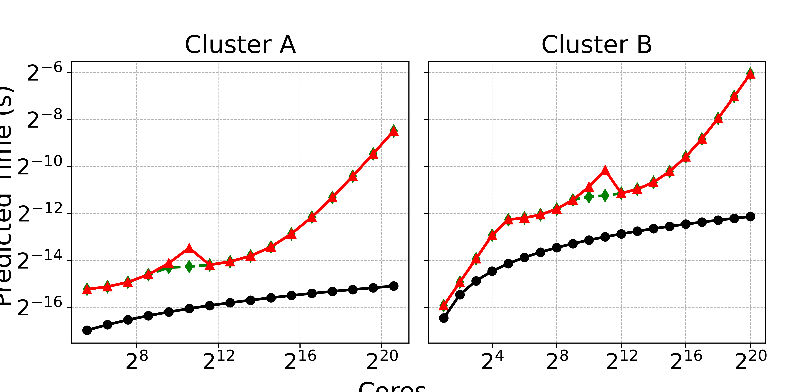

## Second contribution: Termination Semantics
This folder consists of termination semantics offered by conveyors, `SHMEM` blocking barrier, `MPI` non-blocking and blocking variants. Note that `SHMEM` only offers blocking nature of collectives and non-blocking is still pending.

### Installation and Execution
Makefile will generate executables for both programs.
```
make
```

### Sample Output
The output contains CPU cycles measured using `_rdtsc` x86 instruction. This is executed for $100,000$ rounds with time reported as minimum across all rounds, and maximum across all cores within a single round. 

```
[system@termination]$ srun -N 16 -n 256 ./main_01 -r 100000
[Application]: Measurement of your functions for 100000 rounds
System(shmem_block): Time:36236
System(conveyors): Time:35164
System(mpi_block): Time:36138
System(mpi_non_block): Time:35984
```

## Theoretical Model
We feed in the machine values for PACE (Cluster A) and Frontier (Cluster B), obtained from running OSU benchmarks in `theory.ipynb`. We showcase the projection for upto 1M cores in total in `theory-termination.png`


> x-axis are cores in total and y-axis is predicted time in seconds.

### Conclusion
> Given, the total cores as $r$, where $r$ is greater than the crossover point between switch from 2D to 3D topology.

For such $r$ in the system, conveyors termination performance degrades by upto an order of magnitude (attested for 1M cores)!

